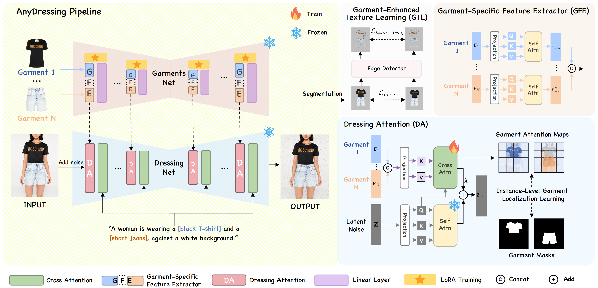

<div align="center">

  <h1 align="center">AnyDressing: Customizable Multi-Garment Virtual Dressing via Latent Diffusion Models</h1>
<!--   <h2 align="center">ICML 2024</h2> -->
  


[Xinghui Li](https://github.com/Crayon-Shinchan), [Qichao Sun](https://github.com/sun631998316), [Pengze Zhang](https://github.com/PangzeCheung), [Fulong Ye](https://scholar.google.com/citations?user=-BbQ5VgAAAAJ&hl=en&oi=ao), [Zhichao Liao](https://scholar.google.com.hk/citations?user=4eRwbOEAAAAJ&hl=zh-CN), [Wanquan Feng](https://scholar.google.com/citations?hl=zh-CN&user=na2akZYAAAAJ&view_op=list_works&sortby=pubdate)✉, [Songtao Zhao](https://crayon-shinchan.github.io/AnyDressing.github.io/)✉, [Qian He](https://scholar.google.com/citations?view_op=list_works&hl=zh-CN&authuser=1&user=9rWWCgUAAAAJ) <br />


### [[`Project Page`](https://crayon-shinchan.github.io/AnyDressing/)][[`arxiv`](https://arxiv.org/abs/2405.19671)][[`Paper`](https://arxiv.org/pdf/2405.19671)]
</div>


## 📃 Abstract
Recent advances in garment-centric image generation from text and image prompts based on diffusion models are impressive. However, existing methods lack support for various combinations of attire, and struggle to preserve the garment details while maintaining faithfulness to the text prompts, limiting their performance across diverse scenarios. 
In this paper, we focus on a new task, i.e., <b><i>Multi-Garment Virtual Dressing</i></b>, and we propose a novel <b>AnyDressing</b> method for customizing characters conditioned on any combination of garments and any personalized text prompts. 
AnyDressing comprises two primary networks named GarmentsNet and DressingNet, which are respectively dedicated to extracting detailed clothing features and generating customized images.
Specifically, we propose an efficient and scalable module called Garment-Specific Feature Extractor in GarmentsNet to individually encode garment textures in parallel. This design prevents garment confusion while ensuring network efficiency. 
Meanwhile, we design an adaptive Dressing-Attention mechanism and a novel Instance-Level Garment Localization Learning strategy in DressingNet to accurately inject multi-garment features into their corresponding regions. This approach efficiently integrates multi-garment texture cues into generated images and further enhances text-image consistency. 
Additionally, we introduce a Garment-Enhanced Texture Learning strategy to improve the fine-grained texture details of garments. 
Thanks to our well-craft design, AnyDressing can serve as a plug-in module to easily integrate with any community control extensions for diffusion models, improving the diversity and controllability of synthesized images. 
Extensive experiments show that AnyDressing achieves state-of-the-art results. 

## 🧭 Overview
<p align="center">

</p>

Given <i>N</i> target garments, AnyDressing customizes a character dressed in multiple target garments. 
The GarmentsNet leverages the <b>Garment-Specific Feature Extractor (GFE)</b> module to extract detailed features from multiple garments. 
The DressingNet integrates these features for virtual dressing using a <b>Dressing-Attention (DA)</b> module and an <b>Instance-Level Garment Localization Learning</b> mechanism. 
Moreover, <b>Garment-Enhanced Texture Learning (GTL)</b> strategy further enhances details. 


## 🌏 Our code is coming soon.
<!-- Thank you all for your attention. I have been busy with my internship and the autumn recruitment recently. I expect to have some free time in October, and at the latest, I will make it open source in November. -->


    
## 🖊 Citation
If you find this project useful in your research, please consider cite:

<!-- ```
@article{xiang2024gaussianroom,
  title={GaussianRoom: Improving 3D Gaussian Splatting with SDF Guidance and Monocular Cues for Indoor Scene Reconstruction},
  author={Xiang, Haodong and Li, Xinghui and Lai, Xiansong and Zhang, Wanting and Liao, Zhichao and Cheng, Kai and Liu, Xueping},
  journal={arXiv preprint arXiv:2405.19671},
  year={2024}
}
``` -->